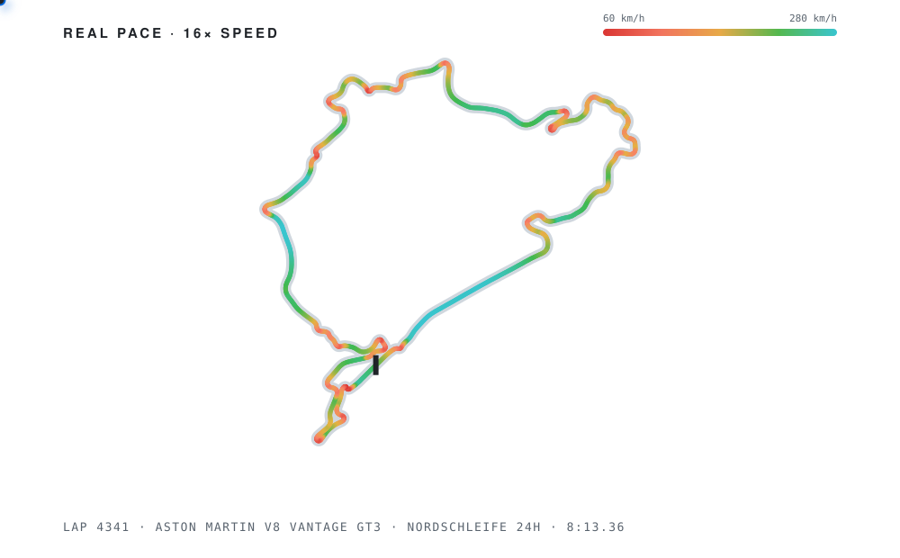
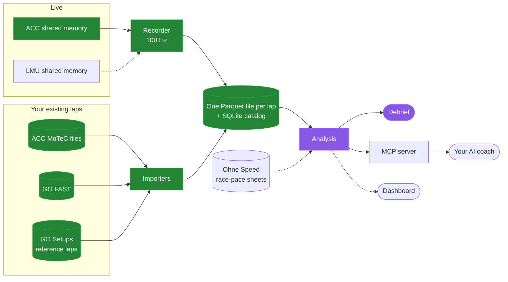

<picture>
  <source media="(prefers-color-scheme: dark)" srcset="docs/assets/banner-dark.svg">
  
</picture>

**Driver profiles and coaching from your own telemetry, for Assetto Corsa Competizione and Le Mans Ultimate.** 
Record your laps · find where you lose time · learn how you drive

> [!NOTE]
> pitwall is in early testing with a small group of drivers. See [Access](#access).

<picture>
  <source media="(prefers-color-scheme: dark)" srcset="docs/assets/track-dark.svg">
  
</picture>
A real Nordschleife 24h lap in the Aston Martin V8 Vantage GT3 (8:13.36). The colour is the speed. The dot drives the lap at 16× real pace.[^art]

## What pitwall does

pitwall collects your laps from ACC and LMU, compares them corner by corner with reference laps and with your own
best laps, and tells you how you drive.

- **A debrief after each stint and session.** The debrief shows what the data says about the laps you just drove:
  where you lost time, and the likely cause (for example early braking, a long coast, or an early turn-in). It runs
  on your PC and uses no AI.
- **A driver profile and an AI coach.** Connect your own AI to your data through an MCP server. It builds your
  driver profile from all your laps: your habits, for example "you brake at the same point as the reference
  drivers, but you release the brake early and carry less speed through the apex". It also shows your trends over
  time, makes practice plans, and answers your questions at any time, not only after a session.

All the numbers come from code. The AI reads the numbers; it never makes them up.

## Features

### Coaching

| | Feature | Status |
|:-:|---|---|
| 📝 | **Debrief:** after each stint and session, the corners where you lost the most time and the likely cause, stint trends, and your progress since your last session, with no AI | 🧪 First version |
| 🔒 | **Consistency:** how repeatable each corner is, and which corners are "locked" (fast and consistent) | ✅ Available |
| 🧑 | **Driver profile:** your habits across all your laps (brake point, brake release, coast, apex speed, throttle) against the reference drivers, built by your AI from pitwall's numbers | ⏳ Planned |
| 🤖 | **AI coach:** your own AI reads your data through an MCP server: trends, practice plans, and questions at any time | ⏳ Planned |

### Analysis

| | Feature | Status |
|:-:|---|---|
| 📐 | **Corner analysis:** a map of each track built from game telemetry, the same corners for every car and lap, and for each lap and corner: brake point, apex speed, coast time and the time gained or lost | ✅ Available |
| 🏆 | **Personal bests:** your PB at every track and the gap to the reference lap, and a PB message in the recorder | ✅ Available |
| 📊 | **Race-pace levels:** your pace for each track and car against [Ohne Speed](#credits)'s race-pace sheets, from Alien to Offline | ⏳ Planned |
| 📈 | **Dashboard:** session review and progress over time | ⏳ Planned |

### Data

| | Feature | Status |
|:-:|---|---|
| 🎙️ | **ACC live recording:** reads ACC telemetry at 100 Hz while you drive, splits it into laps, and saves each lap | ✅ Available |
| 🗄️ | **History import:** your ACC MoTeC files, GO FAST laps (ACC and LMU), and GO Setups reference laps | ✅ Available |
| 🏁 | **LMU live recording:** through the official `LMU_Data` shared memory | ⏳ Planned |

## Access

pitwall is in private testing with a small group of drivers, and the code is in a private repository.
This page describes what pitwall does. To join the tests, ask Jake.

## Where your data is stored

Everything stays on your PC. pitwall does not upload anything.

| What | Where |
|---|---|
| One file for each lap | `data/laps/<game>/<track>/<car>/<session>/lap_NNN.parquet` |
| The lap catalog | `data/pitwall.sqlite` (SQLite: you can open it in any SQLite tool, also while the recorder runs) |

The analysis and the debrief run on your PC. When the MCP server arrives, your AI reads your data only when you ask it.

## Anti-cheat safety

> [!WARNING]
> pitwall only reads game telemetry. It opens the shared memory that the game publishes with `OpenFileMappingW`.
> It never creates a mapping, never writes to game memory, and never injects code. This matters for LMU, which uses EasyAntiCheat.

## How it works

Green parts are available. Purple parts are in development. Dotted lines are planned.

## How lap comparison works

pitwall compares two laps by distance, not by time. At distance $x$ into the lap, the time gap to a reference lap is:

$$\Delta t(x) = \int_{0}^{x} \left( \frac{1}{v_{\text{you}}(s)} - \frac{1}{v_{\text{ref}}(s)} \right) ds$$

The analysis splits every corner into three phases and adds up $\Delta t$ in each phase:

$$\Delta t_{\text{lap}} = \underbrace{\sum \Delta t_{\text{entry}}}_{\text{brake point} \to \text{apex}} + \underbrace{\sum \Delta t_{\text{exit}}}_{\text{apex} \to \text{full throttle}} + \underbrace{\sum \Delta t_{\text{straight}}}_{\text{full throttle} \to \text{next brake}}$$

This shows whether you lose time on corner entry, on corner exit or on the straights, and in which corners.

## Supported data sources

| Source | Format | What it gives | Status |
|---|---|---|---|
| ACC shared memory | Binary structs, 100 Hz | About 100 live channels for each sample, with positions, steering degrees and tyre data | ✅ |
| ACC MoTeC | `.ld` + `.ldx` | 55 channels at up to 200 Hz | ✅ |
| GO FAST | SQLite, Brotli-compressed JSON | ACC and LMU laps at 20 Hz, with validity and fuel | ✅ |
| GO Setups reference laps | MoTeC `.ld` | Esports reference laps | ✅ |
| LMU shared memory | `LMU_Data` (official header) | Live LMU telemetry | ⏳ |

## Credits

- **Ohne Speed** for the ACC and LMU race-pace sheets that the race-pace levels will use.
- **GO Setups** for GO FAST and the reference laps that pitwall imports from your own install.

[^art]: The art is generated from recorded telemetry by a script in the pitwall repository. The dot's path uses SVG `animateMotion`, with `keyTimes` from the real lap clock and `keyPoints` from the distance along the line. So the dot brakes where the driver braked.
